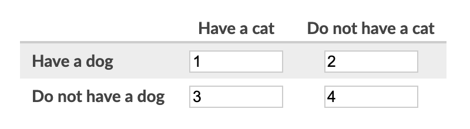
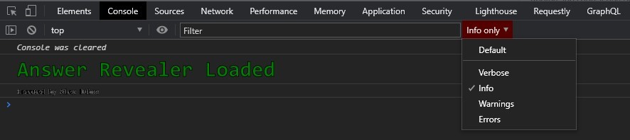

# An answer revealer for Khan Academy

  *Working as of 12/5/2020* 

If this script helped or interested you, please consider staring the repo above. That number looks cool when it's big

## Usage
1. Download a userscript manager like [TamperMonkey for Chrome](https://chrome.google.com/webstore/detail/tampermonkey/dhdgffkkebhmkfjojejmpbldmpobfkfo?hl=en) or [Greasemonkey for Firefox](https://addons.mozilla.org/en-US/firefox/addon/greasemonkey/).
2. Use [this link](https://github.com/adubov1/khanacademy_bot/raw/main/khanacademy_revealer.user.js) to install the script. 
3. Click the extension while in Khan Academy and ensure both the extension and the script are on.
4. Open Developer Tools and go to the Console tab. The script will console log answers as the browser gets them.

## Tips
- Khan Academy always requests the current and next question, so **expect the second to last console log message to be the correct answer**
- When there are multiple answers, fill in the boxes left-to-right and then down. You can also press tab to get to the next field. Example below
  - answer: `[1, 2, 3, 4]`  question: 
- Change your console log level to only **info** for a much better experience

## Gotchas
- This works only for expression, free response, multiple choice, and dropdown questions.
- The script will do its best to find the answer in the question data, but some edge case questions do not follow the same structure, therefore I can't account for them. (read below to understand the exploit)
- If the script breaks for a certain type of question, open an issue and I will take a look.
- I am lazy, therefore this is buggy. Don't be surprised when you run into a question you'll actually have to do

## Exploit
It's pretty simple. On every 'quiz' you open in the app, your browser makes a request to `/getAssessmentItem`. The server responds with everything your client needs to draw **and grade** your question. Within this graphql response is a json blob containing a list of questions, most of them with a `correct: boolean` attribute. Sometimes, they try to throw you off by placing `correct` as the value to a key labeled either `status` or `considered`.

## Implementation
I wrote this for Chrome, although all should work on gecko. It essentially hooks into the browser's `fetch`, which is what Khan Academy uses now instead of `XMLHttpRequest` (this is why the some old exploits no longer work, along with the endpoint change), and when `/getAssessmentItem` is requested, it logs the "important" part of the response.

## Contribution
This is fully open source! If you want to take a crack at automating this script, or if you'd like to add support for more types of questions, like matching for example, feel free to submit a pull request. I'll be sure to credit you accordingly!

## Licence
This has the GNU GPL 3.0 licence. I expect most users will be people like me who have AP Stats assignments and no will to do them.  I don't care too much about what you do with it, but I like credit :)
